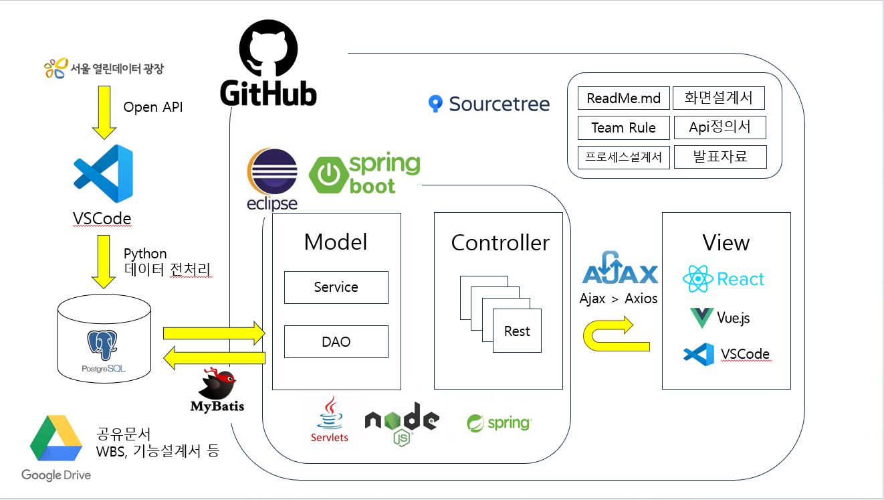

# SAP(Subway Amenities Project) 

구글 드라이버 : https://drive.google.com/drive/folders/1DLYen7Q9-ZSXGzDScXDsAwbRymENAAs3

스마트 지하철 운영 대시보드 (운영자용 그룹웨어)

---

## 📌 프로젝트 소개

프로젝트 목적 : 지하철 담당자가 그룹웨어를 보고 한눈에 편의시설 현황 및 장애/이슈를 알 수 있게 만든 그룹웨어

개발 기간 : 26.01.19 ~ 26.02.26

참여 인원 : 배영환 / 김소연 / 송원호 / 오창석

담당 역할

### 배영환(PM)

- 일정/리스크 관리
- DB 설계
- api 개발
- GitHub

### 김소연(설계자 / 발표)

- 서비스 시나리오
- 화면/UI 설계
- 통계 분석
- 발표 스토리 구성

### 송원호(개발자)

- 로그인 
- 회원가입 
- 대쉬보드 
- 역별현황

### 오창석(개발자)

- 공용화면 
- 마이페이지
- 장애이슈 
- 사용자관리

---

## 🛠 기술 스택
### Backend
- Java 17
- Spring Boot
- JPA / MyBatis
- PostgreSQL

### Frontend
- Vue.js
- Vue Router
- Axios
- Chart.js

### DevOps / Tool
- GitHub
- Postgre
- SourceTree
- VSCode
- Postman

---
### ✨ 주요 기능

✅ 대시보드

✅ 장애 / 이슈 관리

✅ 사용자 관리

✅ 역별현황

✅ 마이페이지

✅ 실시간 노선 운영 현황(고도화)

---
### 🔑 환경 설정

npm:
 
    'npm install'

application.properties

spring:
  
  datasource:
    
    'url: jdbc:postgres://localhost:5432/postgres'
    
    'username: postgres'
   
    'password: 1234'

---

### 화면

